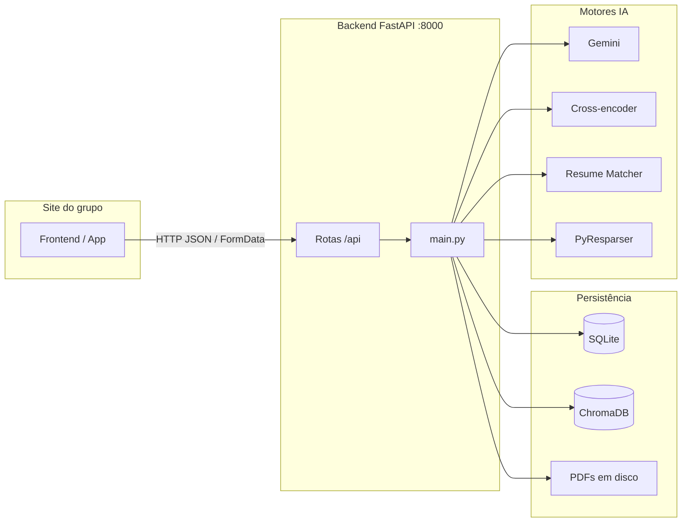
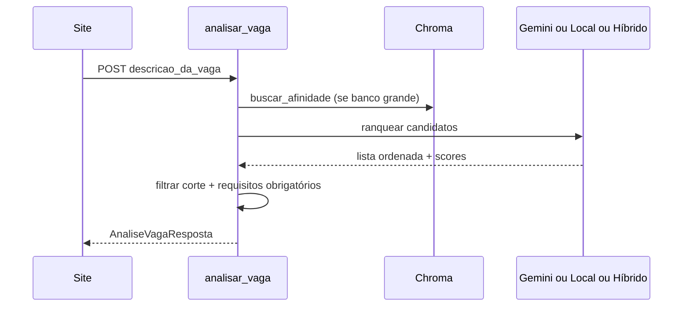

# Documentação de integração — API Backend (Banco de Talentos + IA)

Este documento é o guia oficial para o **grupo integrar o site** com o backend desenvolvido neste repositório. Explica **cada endpoint**, **cada modelo JSON**, **o fluxo de dados** e **cada módulo/função** do código.

---

## Sumário

1. [Visão geral](#1-visão-geral)
2. [Como executar o backend](#2-como-executar-o-backend)
3. [URLs e CORS](#3-urls-e-cors)
4. [Contrato da API (endpoints)](#4-contrato-da-api-endpoints)
5. [Fluxos para o site integrar](#5-fluxos-para-o-site-integrar)
6. [Estrutura de pastas e módulos](#6-estrutura-de-pastas-e-módulos)
7. [Referência de funções por arquivo](#7-referência-de-funções-por-arquivo)
8. [Configuração (.env)](#8-configuração-env)
9. [Motores de análise](#9-motores-de-análise)
10. [Erros HTTP e tratamento](#10-erros-http-e-tratamento)
11. [Exemplos de código (site)](#11-exemplos-de-código-site)

---

## 1. Visão geral

O backend é uma **API REST** em **FastAPI** que:

| Capacidade | Descrição |
|------------|-----------|
| **Indexar currículos** | Recebe PDF, extrai texto, guarda em SQLite + índice vetorial (ChromaDB) |
| **Listar / excluir** | CRUD básico sobre o banco de talentos |
| **Analisar vaga** | Dada uma descrição de vaga, ranqueia os CVs mais aderentes |
| **Compatibilidade avulsa** | Analisa um texto/PDF de CV contra vagas (sem gravar no banco) |



**Prefixo das rotas de negócio:** `/api`  
**Exemplo base em desenvolvimento:** `http://127.0.0.1:8000`

---

## 2. Como executar o backend

### Pré-requisitos

- Python 3.11+
- Dependências: `pip install -r requirements.txt`
- Modelo spaCy (português): `python -m spacy download pt_core_news_sm`
- (Opcional) Corrigir `tokenizers` se der erro ao importar:
  ```powershell
  python -m pip install "tokenizers==0.22.2"
  ```

### Subir o servidor

```powershell
cd backend
python -m uvicorn app.main:app --host 127.0.0.1 --port 8000
```

Ou na raiz do projeto: duplo clique em `iniciar-backend.bat`.

### Verificar se está no ar

```http
GET http://127.0.0.1:8000/saude
```

Resposta esperada:

```json
{
  "situacao": "operante",
  "nome_sistema": "Análise de Currículos com IA"
}
```

### Documentação interativa (Swagger)

- Swagger UI: http://127.0.0.1:8000/docs  
- ReDoc: http://127.0.0.1:8000/redoc  

---

## 3. URLs e CORS

| Recurso | URL |
|---------|-----|
| Healthcheck | `GET /saude` |
| API (talentos) | `GET/POST/DELETE /api/...` |
| Swagger | `/docs` |

**CORS:** o backend aceita origens configuradas em `ORIGEM_PERMITIDA_FRONTEND` (`.env`) e, por regex, qualquer `http://localhost:*` ou `http://127.0.0.1:*`.

Se o site do grupo rodar noutro domínio (ex.: `https://meu-projeto.vercel.app`), adicione no `.env` do backend:

```env
ORIGEM_PERMITIDA_FRONTEND=https://meu-projeto.vercel.app,http://127.0.0.1:5173
```

---

## 4. Contrato da API (endpoints)

### 4.1 `GET /saude`

**Uso no site:** ping / indicador “API online” antes de formulários.

| | |
|--|--|
| **Entrada** | Nenhuma |
| **Saída 200** | `{ "situacao": "operante", "nome_sistema": string }` |

---

### 4.2 `GET /api/sistema/informacoes`

**Uso no site:** rodapé, tela “Sobre”, ou debug — mostra modelos e motor ativo.

| Campo na resposta | Tipo | Significado |
|------------------|------|-------------|
| `nome_sistema` | string | Nome exibido |
| `descricao` | string | Texto de boas-vindas |
| `corte_pontuacao` | number | Afinidade mínima (0–1), ex.: `0.35` = 35% |
| `modelo` | string | Modelo de embeddings (Chroma) |
| `modelo_reclassificador` | string | Cross-encoder local |
| `modelo_analise_vaga` | string | Modelo Gemini configurado |
| `motor_classificacao` | string | `"gemini"` ou `"local"` |
| `chave_gemini_configurada` | boolean | Se há chave Google no `.env` |
| `motor_analise_vaga_padrao` | string | `"padrao"` ou `"hibrido"` |
| `preferir_motor_local` | boolean | Se Gemini está desligado por config |
| `gemini_max_candidatos_lote` | number | Máx. CVs por chamada Gemini |
| `usar_pyresparser` | boolean | Extração estruturada no upload |
| `hibrido_usar_gemini` | boolean | Gemini no motor híbrido |

---

### 4.3 `POST /api/curriculos/enviar`

**Uso no site:** formulário “Candidato envia currículo” ou painel RH que faz upload.

| | |
|--|--|
| **Content-Type** | `multipart/form-data` |
| **Campos** | Ver tabela abaixo |
| **Saída 200** | `CurriculoResumo` |
| **Erros** | `400` — PDF inválido ou sem texto; validação de nome |

| Campo (form) | Obrigatório | Tipo | Descrição |
|--------------|-------------|------|-----------|
| `candidato` | Sim | string | Nome (mín. 2 caracteres) |
| `email` | Não | string | E-mail |
| `arquivo` | Sim | file | **Apenas PDF** |

**O que o backend faz internamente:**

1. Valida extensão `.pdf` e nome seguro  
2. Salva ficheiro em `backend/curriculos_arquivos/{uuid}__{nome}.pdf`  
3. Extrai texto (`pdf_servico.extrair_texto_de_pdf`)  
4. Extrai dados estruturados — skills, experiência (`pyresparser_servico`)  
5. Indexa no ChromaDB (`BancoVetorialTalentos.inserir_curriculo`)  
6. Grava registo no SQLite (`RegistroCurriculo`)

**Resposta (`CurriculoResumo`):**

```json
{
  "id": "550e8400-e29b-41d4-a716-446655440000",
  "nome_candidato": "Maria Silva",
  "email": "maria@email.com",
  "nome_arquivo": "cv_maria.pdf",
  "criado_em": "2026-05-19T12:00:00Z",
  "trecho_vista_previa": "Primeiras linhas do texto extraído..."
}
```

**Importante para o site:** guarde o `id` — é a chave em todas as operações seguintes.

---

### 4.4 `GET /api/curriculos`

**Uso no site:** listagem de candidatos indexados.

| | |
|--|--|
| **Entrada** | Nenhuma |
| **Saída 200** | Array de `CurriculoResumo` (ordenado por data, mais recente primeiro) |

---

### 4.5 `DELETE /api/curriculos/{id_candidato}`

**Uso no site:** botão “Remover currículo”.

| | |
|--|--|
| **Path** | `id_candidato` = UUID retornado no upload |
| **Saída 200** | `{ "mensagem": "Registro excluído com sucesso." }` |
| **Erro 404** | ID inexistente |

Remove: registo SQL, entrada Chroma e ficheiro PDF.

---

### 4.6 `POST /api/vaga/analise` ⭐ (principal para o site)

**Uso no site:** tela “Vaga em aberto” — RH cola a descrição e recebe ranking de candidatos.

| | |
|--|--|
| **Content-Type** | `application/json` |
| **Corpo** | `EnvioVagaRequisicao` |
| **Saída 200** | `AnaliseVagaResposta` |

**Corpo da requisição (`EnvioVagaRequisicao`):**

```json
{
  "descricao_da_vaga": "Desenvolvedora backend Python, FastAPI, SQL, 3+ anos...",
  "quantidade_sugerida": 5,
  "requisitos_obrigatorios": ["Python", "experiência com APIs REST"],
  "requisitos_desejaveis": ["Docker", "AWS"],
  "motor_analise": "padrao"
}
```

| Campo | Obrigatório | Tipo | Regras |
|-------|-------------|------|--------|
| `descricao_da_vaga` | Sim | string | Mín. 10 caracteres |
| `quantidade_sugerida` | Não | int | 1–30, padrão `5` |
| `requisitos_obrigatorios` | Não | string[] | Evidência lexical no CV |
| `requisitos_desejaveis` | Não | string[] | Enriquecem o texto da vaga |
| `motor_analise` | Não | `"padrao"` \| `"hibrido"` | Padrão vem do `.env` se omitido |

**Resposta (`AnaliseVagaResposta`):**

```json
{
  "mensagem_status": "Análise concluída com gemini-2.0-flash-lite...",
  "total_antes_corte": 24,
  "resultados": [
    {
      "id_candidato": "uuid",
      "nome_candidato": "Maria Silva",
      "email": "maria@email.com",
      "nome_arquivo_original": "cv.pdf",
      "pontuacao_afinidade": 0.72,
      "score_0_100": 78,
      "justificativa": "Texto explicando o match...",
      "atende_requisitos_obrigatorios": true,
      "lacunas_requisitos_obrigatorios": [],
      "lacunas_competencias_vaga": ["kubernetes"],
      "comentario_padrao": "Ordenado por afinidade com a vaga..."
    }
  ]
}
```

| Campo do candidato | Significado para o UI |
|--------------------|------------------------|
| `pontuacao_afinidade` | Score **0.0 a 1.0** (exibir como %) |
| `score_0_100` | Score Gemini 0–100 (pode ser `null` no modo só local) |
| `justificativa` | Texto para o recrutador ler |
| `atende_requisitos_obrigatorios` | `false` = marcado como aproximação |
| `lacunas_requisitos_obrigatorios` | Lista do que faltou nos obrigatórios |
| `lacunas_competencias_vaga` | Preenchido no motor **hibrido** (Resume Matcher) |

**Regra de corte:** só entram candidatos com `pontuacao_afinidade >= corte_pontuacao` (padrão **0.35**). Se ninguém passar, `resultados` vem **vazio** e `mensagem_status` explica.

**Fluxo interno resumido:**



---

### 4.7 `POST /api/vaga/analise-hibrida`

**Uso no site:** atalho — **mesmo corpo e mesma resposta** que `/vaga/analise`, mas força `motor_analise: "hibrido"`.

Equivalente a:

```json
{ "motor_analise": "hibrido", "...": "..." }
```

---

### 4.8 `POST /api/curriculo/compatibilidade` (opcional)

**Uso no site:** ferramenta “Analisar um CV sem cadastrar” (colar texto).

| | |
|--|--|
| **Content-Type** | `application/json` |
| **Corpo** | `RequisicaoCompatibilidadeVagas` |
| **Não grava** no banco de talentos |

```json
{
  "texto": "Texto completo do currículo colado aqui...",
  "vagas": [
    { "nome": "Backend Python", "descricao": "FastAPI, SQL..." }
  ]
}
```

Se `vagas` for omitido ou vazio, usa vagas de referência internas (Backend, Dados, etc.).

**Resposta:** perfil spaCy, aderência por vaga (%), classificação de área — ver `AnaliseCompatibilidadeVagasResposta` no Swagger.

---

### 4.9 `POST /api/curriculo/compatibilidade-pdf` (opcional)

Igual ao anterior, mas envia **PDF** em `multipart/form-data`:

| Campo | Tipo |
|-------|------|
| `arquivo` | file (PDF) |
| `vagas_json` | string opcional — JSON array `[{"nome":"...","descricao":"..."}]` |

---

## 5. Fluxos para o site integrar

### Fluxo A — Cadastro de candidato (mínimo)

```
1. POST /api/curriculos/enviar  (FormData)
2. Guardar response.id no estado do site
3. GET /api/curriculos  (atualizar lista admin)
```

### Fluxo B — Busca por vaga (principal)

```
1. Garantir GET /saude OK
2. POST /api/vaga/analise  (JSON)
3. Renderizar resultados[] ordenados (#1, #2, ...)
4. Exibir pontuacao_afinidade * 100 como %
5. Exibir justificativa e lacunas_*
```

### Fluxo C — Painel administrativo

```
GET /api/curriculos
DELETE /api/curriculos/{id}  (com confirmação)
GET /api/sistema/informacoes  (rodapé / config)
```

---

## 6. Estrutura de pastas e módulos

```
backend/
├── app/
│   ├── main.py              # Rotas FastAPI, orquestração
│   ├── modelos.py           # Contratos Pydantic (JSON)
│   ├── configuracao.py      # Variáveis .env
│   ├── banco_dados.py       # SQLite + ORM
│   └── servicos/
│       ├── pdf_servico.py           # PDF → texto
│       ├── ia_banco_talentos.py     # ChromaDB
│       ├── reclassificacao_vaga.py  # Cross-encoder (motor padrão)
│       ├── gemini_talentos.py       # Google Gemini
│       ├── pyresparser_servico.py   # Extração estruturada CV
│       ├── resume_matcher_servico.py # TF-IDF + semântico + skills
│       ├── pipeline_hibrido_vaga.py # Orquestra motor híbrido
│       └── pipeline_curriculo_vagas.py  # Análise avulsa spaCy+ST
├── armazenamento/           # Criado em runtime (SQLite + Chroma)
├── curriculos_arquivos/     # PDFs guardados
├── requirements.txt
├── .env.example
└── INTEGRACAO_GRUPO.md      # Este ficheiro
```

---

## 7. Referência de funções por arquivo

### 7.1 `app/main.py` — Camada HTTP

| Função / rota | Responsabilidade |
|---------------|------------------|
| `verificar_saude()` | `GET /saude` |
| `informacoes()` | `GET /api/sistema/informacoes` |
| `enviar_curriculo()` | Upload PDF + indexação |
| `listar()` | Lista CVs |
| `excluir()` | Remove CV, vetor e PDF |
| `analisar_vaga()` | Ranking principal |
| `analisar_vaga_hibrida()` | Atalho motor híbrido |
| `analisar_compatibilidade_vagas()` | CV texto vs vagas (sem DB) |
| `analisar_compatibilidade_vagas_pdf()` | CV PDF vs vagas (sem DB) |
| `obter_banco_vetorial()` | Singleton Chroma (lazy load) |
| `get_db()` | Sessão SQLAlchemy por request |
| `_apenas_nome_extensao()` | Valida `.pdf` e path seguro |
| `_descricao_vaga_com_requisitos()` | Junta descrição + listas obrigatório/desejável |
| `_avaliar_requisitos_obrigatorios()` | Verifica se termos aparecem no CV |
| `_montar_resposta_candidato()` | Monta `CandidatoResultadoResposta` |
| `_justificativa_para_exibicao()` | Texto final de justificativa |
| `_ordenar_candidatos_local()` | Cross-encoder com fallback lexical |
| `_pool_candidatos_para_gemini()` | Limita N CVs enviados ao Gemini |
| `_mesclar_ordem_gemini_com_local()` | Combina scores Gemini + local |
| `tratamento_erro_generico()` | Handler 500 global |

### 7.2 `app/modelos.py` — Contratos JSON

| Classe | Usada em |
|--------|----------|
| `EnvioVagaRequisicao` | `POST /vaga/analise` |
| `AnaliseVagaResposta` | Resposta da análise de vaga |
| `CandidatoResultadoResposta` | Um item do ranking |
| `CurriculoResumo` | Upload e listagem |
| `MensagemSimples` | Delete |
| `RequisicaoCompatibilidadeVagas` | Compatibilidade texto |
| `AnaliseCompatibilidadeVagasResposta` | Resposta compatibilidade |
| `VagaComparacaoItem` | Item de vaga na compatibilidade |

### 7.3 `app/banco_dados.py` — Persistência

| Função / classe | Responsabilidade |
|-----------------|------------------|
| `RegistroCurriculo` | Tabela `registros_curriculos` |
| `init_banco()` | Cria SQLite + migra colunas |
| `_migrar_sqlite()` | `ALTER TABLE` se faltar coluna nova |
| `abrir_sessao()` | Factory de sessão ORM |

**Colunas importantes (`RegistroCurriculo`):**

| Coluna | Uso |
|--------|-----|
| `id` | UUID público |
| `texto_indexado` | Texto extraído do PDF (busca e IA) |
| `dados_estruturados_json` | Skills/experiência (motor híbrido) |
| `caminho_relativo_pdf` | Onde está o PDF no disco |

### 7.4 `app/configuracao.py`

| Função / classe | Responsabilidade |
|-----------------|------------------|
| `Configuracao` | Todas as variáveis do `.env` |
| `obter_caminho_backend()` | Raiz da pasta `backend/` |
| `resolver_caminho()` | Caminhos absolutos para pastas |

### 7.5 `app/servicos/pdf_servico.py`

| Função | Responsabilidade |
|--------|------------------|
| `extrair_texto_de_pdf(caminho, tamanho_maximo)` | pdfplumber → fallback PyMuPDF; trunca texto |

### 7.6 `app/servicos/ia_banco_talentos.py`

| Classe / método | Responsabilidade |
|-----------------|------------------|
| `BancoVetorialTalentos` | Cliente Chroma persistente |
| `inserir_curriculo(texto, metadados)` | Upsert embedding por `candidato_id` |
| `buscar_afinidade(descricao_vaga, limite)` | Query por similaridade de cosseno |
| `remover(ident)` | Delete do índice |

### 7.7 `app/servicos/reclassificacao_vaga.py` — Motor **padrão** (local)

| Função | Responsabilidade |
|--------|------------------|
| `ordenar_por_aderencia(config, vaga, [(id, texto)])` | Ranking com cross-encoder + cobertura lexical |
| `ordenar_por_aderencia_lexical(...)` | Fallback se modelo pesado falhar |
| `pontuacao_final_aderencia(...)` | Combina scores (pesos em `.env`) |
| `justificativa_resumo_local(...)` | Texto explicativo sem Gemini |
| `cobertura_termos_vaga_no_texto(...)` | % termos da vaga no CV |

### 7.8 `app/servicos/gemini_talentos.py` — Google Gemini

| Função | Responsabilidade |
|--------|------------------|
| `chave_disponivel(config)` | Se existe `CHAVE_API_GEMINI` / `GOOGLE_API_KEY` |
| `ordenar_talentos_por_gemini(...)` | Entrada: trios `(id, nome, texto)`; saída scores 0–1 + justificativa |
| `ordenar_talentos_por_gemini_lote(...)` | Uma chamada API para vários CVs |
| `ErroQuotaGemini` | HTTP 429 — dispara fallback no motor padrão |

### 7.9 `app/servicos/pyresparser_servico.py` — Estrutura do CV

| Função | Responsabilidade |
|--------|------------------|
| `extrair_dados_estruturados(config, pdf, texto)` | PyResparser se instalado; senão heurística PT |
| `serializar_dados_estruturados(dados)` | JSON para coluna SQLite |
| `dados_estruturados_de_json(bruto)` | Leitura no motor híbrido |

**Formato JSON guardado (exemplo):**

```json
{
  "fonte": "heuristica_pt",
  "habilidades": ["python", "sql", "dados"],
  "experiencia_anos": 5,
  "empresas": ["Empresa X Ltda"],
  "email_detectado": "a@b.com"
}
```

### 7.10 `app/servicos/resume_matcher_servico.py` — Motor **híbrido** (ranking)

| Função | Responsabilidade |
|--------|------------------|
| `ordenar_por_resume_matcher(...)` | Ranking completo estilo Resume Matcher |
| `pontuar_candidato_resume_matcher(...)` | Score 0–1 + justificativa + lacunas |
| `extrair_competencias_vaga(descricao)` | Skills pedidas na vaga |
| `_similaridade_tfidf` | Match lexical (sklearn) |
| `_similaridade_semantica` | Embeddings Sentence-Transformers |

**Pesos (`.env`):** `PESO_RM_SEMANTICO`, `PESO_RM_TFIDF`, `PESO_RM_SKILLS`, `PESO_RM_EXPERIENCIA`

### 7.11 `app/servicos/pipeline_hibrido_vaga.py`

| Função | Responsabilidade |
|--------|------------------|
| `executar_pipeline_hibrido_vaga(...)` | Orquestra RM → Gemini opcional nos top-N |
| `_mesclar_com_gemini(...)` | Substitui scores dos melhores candidatos |

### 7.12 `app/servicos/pipeline_curriculo_vagas.py` — Compatibilidade avulsa

| Função | Responsabilidade |
|--------|------------------|
| `executar_pipeline_curriculo(texto, config, ...)` | spaCy + ST vs vagas + NLI perfil |
| `ResultadoPipelineCurriculo` | DTO interno com entidades e scores |

---

## 8. Configuração (.env)

Copie `backend/.env.example` para `backend/.env`.

| Variável | Padrão | Efeito na integração |
|----------|--------|----------------------|
| `PORTA_API` | `8000` | Porta do servidor |
| `ORIGEM_PERMITIDA_FRONTEND` | localhost:5173… | CORS para o site |
| `CHAVE_API_GEMINI` | vazio | Sem chave = só motor local/híbrido sem Gemini |
| `CORTE_PONTUACAO_MINIMA` | `0.35` | Candidatos abaixo disso **não aparecem** |
| `MOTOR_ANALISE_VAGA` | `padrao` | Default se o site não enviar `motor_analise` |
| `PREFERIR_MOTOR_LOCAL` | `false` | `true` = nunca chama Gemini |
| `HIBRIDO_USAR_GEMINI` | `true` | Gemini nos top-N no modo híbrido |
| `GEMINI_MAX_CANDIDATOS_LOTE` | `18` | Limite de quota |
| `OCULTAR_ERROS_500` | — | `1` = mensagem genérica em produção |

---

## 9. Motores de análise

| `motor_analise` | Quando usar | Tecnologias |
|-----------------|-------------|-------------|
| **`padrao`** | Produção geral; banco grande | Chroma → Gemini **ou** cross-encoder |
| **`hibrido`** | Mais explicação por skills/lacunas | PyResparser + Resume Matcher + Gemini opcional |

**Recomendação para o site do grupo:**

- Tela RH / matching de vagas: `motor_analise: "hibrido"` (justificativas e `lacunas_competencias_vaga`)
- Se Gemini der 429: continua funcionando (fallback automático no motor padrão; híbrido mantém Resume Matcher)

---

## 10. Erros HTTP e tratamento

| Código | Quando | `detail` (exemplo) |
|--------|--------|---------------------|
| **400** | PDF inválido, texto curto, nome curto | Mensagem em português |
| **404** | DELETE de ID inexistente | `Registro inexistente.` |
| **422** | JSON inválido (FastAPI) | Lista de campos com erro |
| **500** | Erro interno (modelo, disco) | `TipoErro: mensagem` (ou genérico se `OCULTAR_ERROS_500=1`) |
| **502** | Só se `APENAS_GEMINI=true` e Gemini falhar | Mensagem de quota/indisponível |
| **503** | `APENAS_GEMINI=true` sem chave | Pedir `CHAVE_API_GEMINI` |

**No frontend:** sempre ler `response.json().detail` em erros FastAPI.

**Timeouts:** primeira análise pode demorar **1–3 min** (download de modelos). Use timeout ≥ 120s no `fetch`.

---

## 11. Exemplos de código (site)

### JavaScript — Upload de currículo

```javascript
const API = 'http://127.0.0.1:8000/api';

async function enviarCurriculo(nome, email, arquivoPdf) {
  const form = new FormData();
  form.append('candidato', nome);
  if (email) form.append('email', email);
  form.append('arquivo', arquivoPdf);

  const res = await fetch(`${API}/curriculos/enviar`, {
    method: 'POST',
    body: form,
  });
  if (!res.ok) {
    const err = await res.json();
    throw new Error(err.detail || res.statusText);
  }
  return res.json(); // CurriculoResumo — guardar .id
}
```

### JavaScript — Analisar vaga

```javascript
async function analisarVaga(descricao, quantidade = 5, motor = 'hibrido') {
  const res = await fetch(`${API}/vaga/analise`, {
    method: 'POST',
    headers: { 'Content-Type': 'application/json' },
    body: JSON.stringify({
      descricao_da_vaga: descricao,
      quantidade_sugerida: quantidade,
      motor_analise: motor,
      requisitos_obrigatorios: ['Python', 'FastAPI'],
      requisitos_desejaveis: ['Docker'],
    }),
    signal: AbortSignal.timeout(600_000), // 10 min
  });
  if (!res.ok) {
    const err = await res.json();
    throw new Error(typeof err.detail === 'string' ? err.detail : JSON.stringify(err.detail));
  }
  return res.json(); // AnaliseVagaResposta
}
```

### JavaScript — Exibir resultado

```javascript
function renderRanking(analise) {
  if (analise.resultados.length === 0) {
    console.log(analise.mensagem_status);
    return;
  }
  analise.resultados.forEach((c, i) => {
    const pct = (c.pontuacao_afinidade * 100).toFixed(1);
    console.log(`#${i + 1} ${c.nome_candidato} — ${pct}%`, c.justificativa);
  });
}
```

### cURL — Teste rápido

```bash
# Health
curl http://127.0.0.1:8000/saude

# Listar
curl http://127.0.0.1:8000/api/curriculos

# Vaga
curl -X POST http://127.0.0.1:8000/api/vaga/analise \
  -H "Content-Type: application/json" \
  -d "{\"descricao_da_vaga\":\"Dev Python FastAPI SQL experiência 3 anos\",\"quantidade_sugerida\":5,\"motor_analise\":\"hibrido\"}"
```

### Python — requests

```python
import requests

BASE = "http://127.0.0.1:8000/api"

# Upload
with open("curriculo.pdf", "rb") as f:
    r = requests.post(
        f"{BASE}/curriculos/enviar",
        data={"candidato": "João", "email": "joao@mail.com"},
        files={"arquivo": ("cv.pdf", f, "application/pdf")},
        timeout=120,
    )
r.raise_for_status()
candidato_id = r.json()["id"]

# Análise
r = requests.post(
    f"{BASE}/vaga/analise",
    json={
        "descricao_da_vaga": "Analista de dados Python, SQL, Power BI...",
        "quantidade_sugerida": 5,
        "motor_analise": "hibrido",
    },
    timeout=600,
)
r.raise_for_status()
for i, c in enumerate(r.json()["resultados"], 1):
    print(i, c["nome_candidato"], c["pontuacao_afinidade"], c.get("justificativa"))
```

---

## Checklist de integração (grupo)

- [ ] Backend a correr em URL acordada (`127.0.0.1:8000` ou servidor do grupo)
- [ ] CORS configurado com URL do site
- [ ] `GET /saude` antes de fluxos críticos
- [ ] Upload usa `multipart/form-data` com campo `arquivo`
- [ ] Análise de vaga usa `application/json`
- [ ] UI trata `resultados` vazio + `mensagem_status`
- [ ] Exibe `pontuacao_afinidade` como percentagem
- [ ] Timeout generoso na primeira chamada (modelos a carregar)
- [ ] Guardar `id_candidato` após upload para futuras features

---

## Contacto técnico (responsável pelo backend)

Entregáveis desta parte do projeto:

| Item | Local |
|------|--------|
| Código API | `backend/app/` |
| Dependências | `backend/requirements.txt` |
| Config exemplo | `backend/.env.example` |
| Script Windows | `iniciar-backend.bat` |
| Doc operacional | `backend/README.md` |
| **Doc integração (este ficheiro)** | `backend/INTEGRACAO_GRUPO.md` |

Para dúvidas de contrato JSON, use sempre o **Swagger** em `/docs` com o servidor ligado — é a fonte gerada automaticamente a partir dos mesmos modelos Pydantic.
